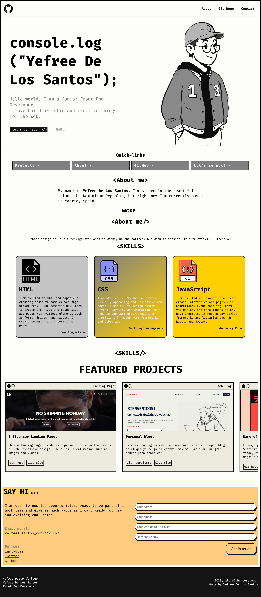

# MY PERSONAL PORTFOLIO SITE. VERSION 2.1 😋

My latest project is a one-page portfolio website that showcases my best work and highlights my skills as a junior web developer. I built it using semantic HTML5, CSS (SCSS), and JavaScript. Build entirely with Astro This site not only displays my important information but also reflects my personality. Check it out and let me know what you think! 🌟💻

## Table of contents

- [Overview](#overview)
  - [Screenshot](#screenshot)
  - [Links](#links)
- [My process](#my-process)
  - [Built with](#built-with)
  - [Interesting code](#what-i-learned)
  - [Continued development](#continued-development)
  - [Useful resources](#useful-resources)
- [Author](#author)

## Overview

This is a "little" challenge I dived myself into to practice the basic fundamentals of web design and markup.

### Screenshot



### Links

- Code repository URL: (https://github.com/yefreescoding/Portfolio.git)
- Live Site URL: (https://portfolioyefreevaldez.vercel.app/)

## My process

### Built with

- Semantic HTML5 markup
- CSS custom properties
- FlexBox
- CSS Grid
- Mobile-first workflow
- JavaScript
- Astro

### Interesting code

```html
<div class="title-skills grid">
  <span
    >"Good design is like a refrigerator—when it works, no one notices, but when
    it doesn't, it sure stinks." - Irene Au</span
  >
  <h2>&lt;SKILLS&gt;</h2>
</div>
```

```css(scss)
--min-column-size: 25rem;
 grid-template-columns:
    repeat(auto-fit, minmax(min(var(--min-column-size), 100%), 1fr));
```

```js
// Create an instance of IntersectionObserver with a callback function as a parameter
const observer = new IntersectionObserver((entries) => {
  // For each entry in the entries array passed to the callback function
  entries.forEach((entry) => {
    // Log the current entry to the console
    console.log(entry);
    // If the current entry is intersecting with the viewport
    if (entry.isIntersecting) {
      // Add the 'show' class to the target element of the entry
      entry.target.classList.add('show');
    } // else {
    // Otherwise, remove the 'show' class from the target element of the entry
    //entry.target.classList.remove('show');
    //}
  });
});

// Find all elements with the class 'hide'
const hiddenElements = document.querySelectorAll('.hidden');
// For each element found, add it to the observer to be monitored for intersection
hiddenElements.forEach((el) => observer.observe(el));
```

### Continued development

I want to continue learning about manipulating the DOM, and practice with all the new CSS concepts that keep emerging, such as positioning elements with Flexbox and Grid. Additionally, I believe I need to gain a deeper understanding of the concepts of JavaScript

### Useful resources

- [Example resource 1](https://www.example.com) - This helped me for XYZ reason. I really liked this pattern and will use it going forward.
- [Example resource 2](https://www.example.com) - This is an amazing article which helped me finally understand XYZ. I'd recommend it to anyone still learning this concept.

## Author

- Website - [Yefree De Los Santos](https://www.your-site.com)
- Twitter - [@YefreeCodes](https://twitter.com/YefreeCodes)
